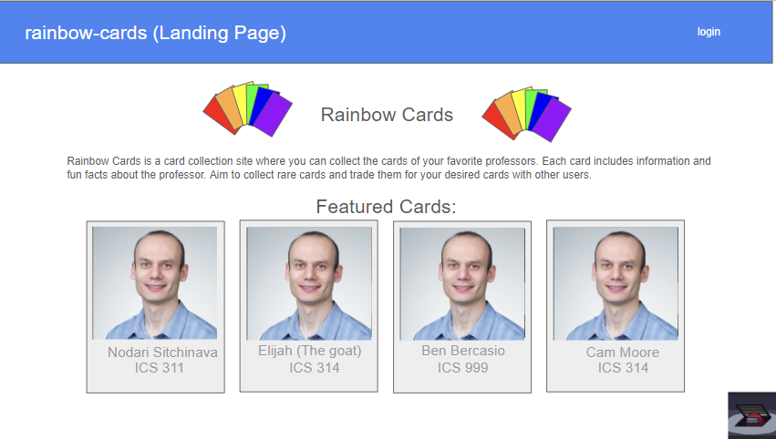
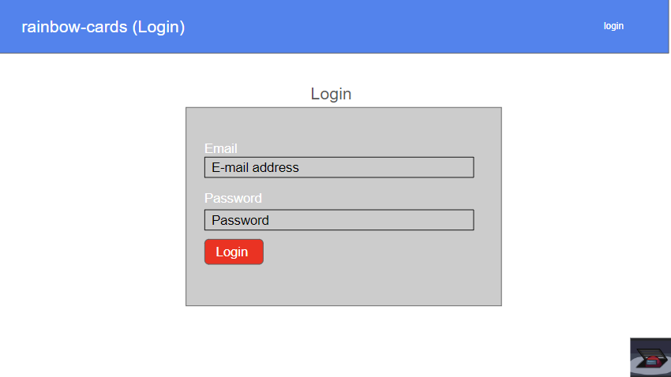
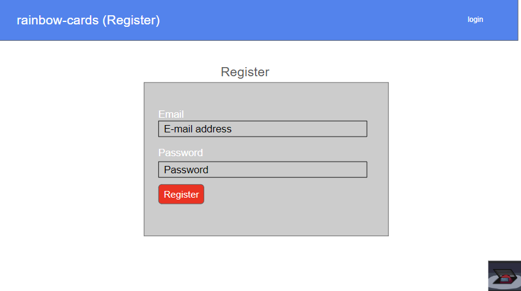
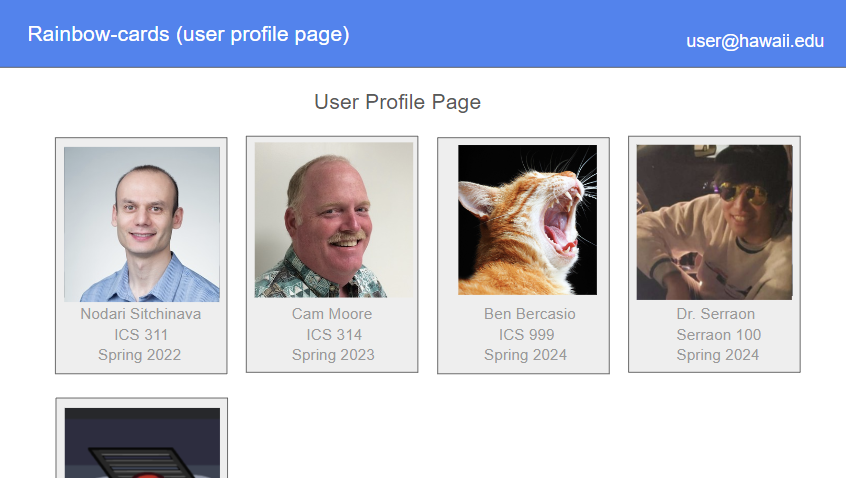
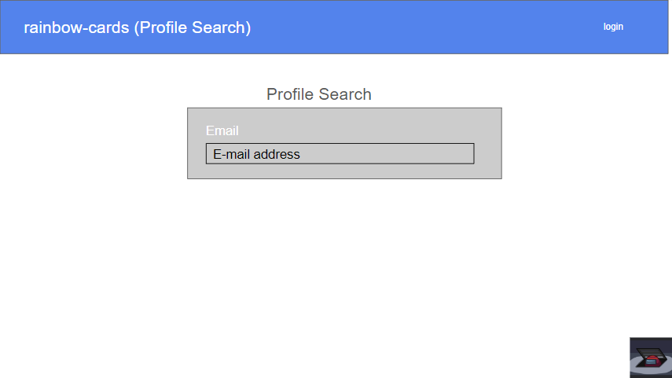
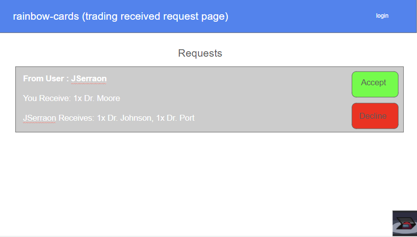
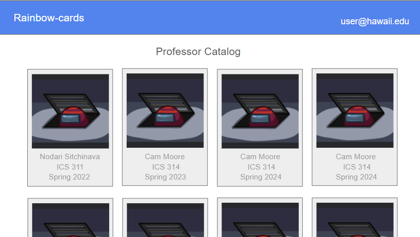
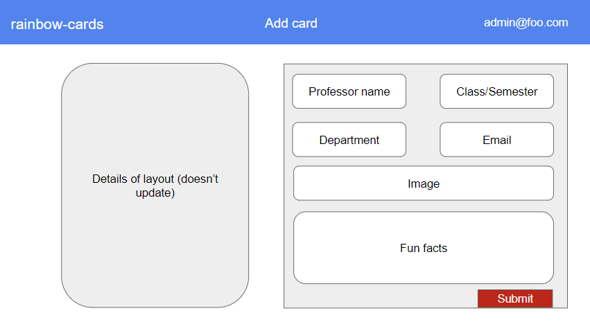
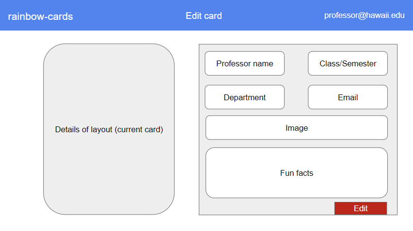

## Table of Contents
* [Overview](#overview)
* [Project Features](#project-features)
* [Walkthrough](#walkthrough)
* [Developer Guide](#developer-guide)
* [Development Timeline](#development-timeline)
* [The Rainbow Cards Team](#the-rainbow-cards-team)
* [Links](#links)

## Overview

Manoa Rainbow Cards is a Trading Card Game (TCG) app where the [University of Hawai'i at Manoa](https://manoa.hawaii.edu/) professors are the cards! Developed by the [team](#the-rainbow-cards-team) at Rainbow Cards.

This TCG application aims to increase familiarity and engagement between the students and professors of the UH Manoa campus. Each professor card comes with various contact information, projects/achievements and fun facts about them, which may also be traded between users of the app. This further fosters a sense of community on campus, and helps students connect to their mentors better in a fun and engaging way!

The Manoa Rainbow Cards project implements the following technologies and resources:
* [GitHub](https://github.com/)
* [Meteor](https://www.meteor.com/)
* [React](https://reactjs.org/)
* [IntelliJ IDEA](https://www.jetbrains.com/idea/)

## Project Features

Manoa Rainbow Cards is planned to have features such as:
* Viewable user profiles, which displays their cards with a degree of customizability
* Search function to find other users' profiles
* Catalog of all professor cards to see all cards that a user owns and doesn't own
* Ability for professors to register on the app and edit their own cards
* Cards with secret information that is only revealed once the card is obtained (what is that professor's super cool hobby, anyway?)

## Walkthrough
A quick tour through our current mockup of the Manoa Rainbow Cards website (updated 4/5).

### Landing Page
The default page for Manoa Rainbow Cards, which informs the user about the site and how users can participate.



### Login & Register Pages
After clicking on the login button, a login page is displayed: 


If the user does not have an account or wishes to create one, they will be able to navigate to a sign up page to register for an account: 


### User Profile Page
Upon signing in with an account, the user can click their account name button to reach their profile page:


 This page will display all of the user's Rainbow Cards, which can be rearranged according to the user's preferences. If a user has more than one of a Rainbow Card, it will be displayed. The profile may also include features like displaying which cards the user wants to trade away or collect, as well as displaying user's interests.
 
### Profile Search Page
Users will be able to search for other profiles, such as by account name/email (as seen below):


Other methods may be introduced such as searching by card, or a site suggestion feature that spotlights user profiles at random. This can help users find Rainbow Cards they want to trade for, and can match a professor's cards to the user's interests to help them learn more about the UH faculty.

### Trade Requests Page
Users can also navigate to a page where they can view trade requests they have received:
 

From here, users can accept or decline the offer, or navigate to the requester's profile.

### Card Catalog Page
Users can also view a catalog page of all Rainbow Cards in the database:


This page allows users to browse through the different professors' cards, letting them find out more about them or figure out who they want to know more about.

### Add Card Page (Admin)
Rainbow Cards can be added at the adminstrator-level, which will appear in a format like this:



Information like the professor's name, an image of them, the class and semester the card is based on, the department the professor is under, their email, and a variety of fun facts and achievements can be entered.

### Edit Card Page (Admin)
Adminstrators can also edit information on any Rainbow Card. The page will appear in a similar format to adding a card. The current card can be previewed on the side so the editor can refer to its information as they make changes:


### Edit Card Page (Professor)
Professors will be able to make an account with professor-level privileges, allowing them to edit cards associated with themselves only. The form is the same as the admin version:


## Developer Guide
- First, [install Meteor](https://www.meteor.com/install), and [GitHub Desktop](https://desktop.github.com/).
- Second, go to [the Manoa Rainbow Cards repo](https://github.com/rainbow-cards/rainbow-cards.github.io), click the "Code" dropdown and clone the digits repo (i.e. using the "Open with GitHub Desktop" option).
- Third, cd into the app/ directory of your local copy of Manoa Rainbow Cards, and install third party libraries via cmd or PowerShell:

```
$ meteor npm install
```
- Fourth, once the libraries are installed, you can run the application by invoking the following:
```
$ meteor npm run start
```
- Lastly, navigate to http://localhost:3000 to see the application running.

## Development Timeline
- Created a Team Contract [4/2]
  - [Rainbow Cards Team Contract Google Doc](https://docs.google.com/document/d/1mPT3OwNUSHKBWtyxrerqiRkuc8SAxzc78EGnRSRvwDk/edit?usp=sharing)
- Created a GitHub organization and home page (4/3-4/4)
  - [Rainbow Cards GitHub Organization](https://github.com/rainbow-cards)
- Began Issue Driven Project Management (4/4)
  - [M1 Project Page](https://github.com/orgs/rainbow-cards/projects/1/views/1) (admin/collaborator-only access)
- Experienced a team presentation (4/4)
  - [Manoa Rainbow Cards Site Mockup Slides](https://docs.google.com/presentation/d/1dAR1c53dGjUel7C0VYMQQaqJKXNSGDNJ1eTtrfUuGn8/edit?usp=sharing)
- Final Project Milestone #1 (4/11)
  - TBD
- Deploy the final project to Digital Ocean (4/11)
  - TBD
- Final Project Milestone #2 (4/23)
  - TBD
- Final Project Milestone #3 (5/1)
  - TBD

## The Rainbow Cards Team
* Elijah Saloma	      (esaloma@hawaii.edu)
* Daevin Bagcal	      (daevinb@hawaii.edu)
* Benjamin Bercasio	  (bbercasi@hawaii.edu)
* John Serraon		    (jserraon@hawaii.edu)
* Yuzuki Fujimoto	    (yuzukif@hawaii.edu)

## Links
* [Rainbow Cards GitHub Organization](https://github.com/rainbow-cards)
* [Manoa Rainbow Cards project repo](https://github.com/rainbow-cards/rainbow-cards.github.io)
* [Manoa Rainbow Cards Site Mockup Slides](https://docs.google.com/presentation/d/1dAR1c53dGjUel7C0VYMQQaqJKXNSGDNJ1eTtrfUuGn8/edit?usp=sharing)
