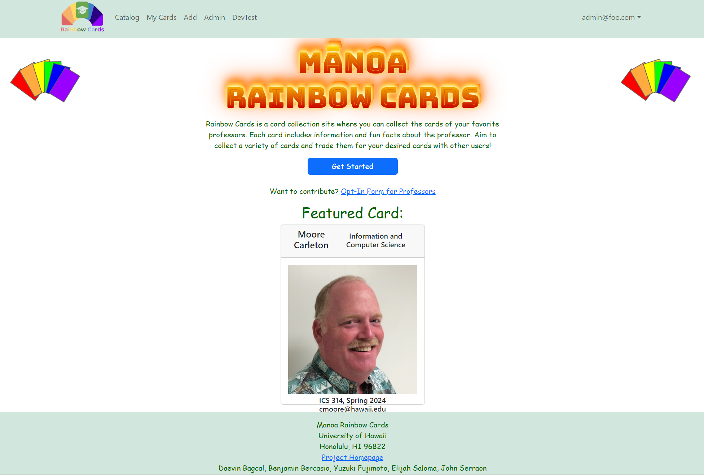
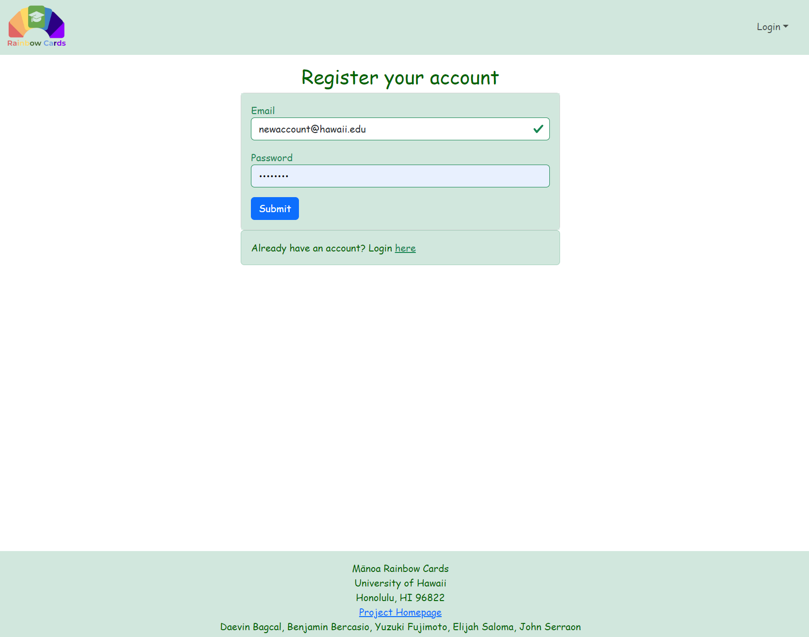
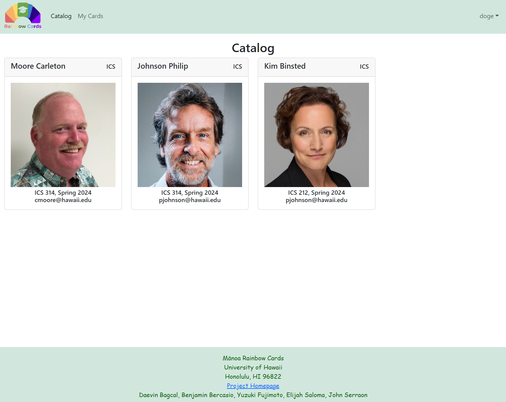
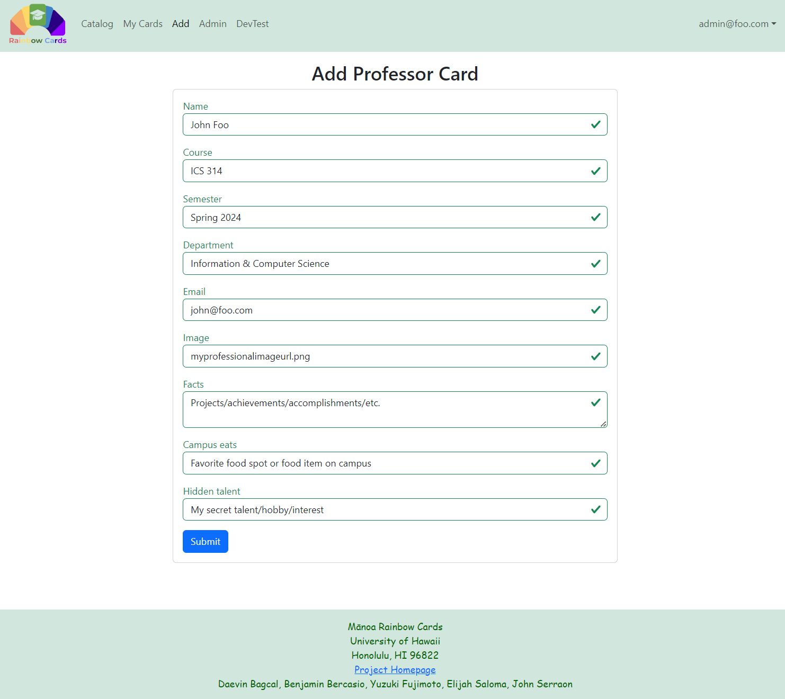

## Table of Contents
* [Deployment](#deployment)
* [Overview](#overview)
* [Project Features](#project-features)
* [User Guide](#user-guide)
* [Developer Guide](#developer-guide)
* [Development Timeline](#development-timeline)
* [The Rainbow Cards Team](#the-rainbow-cards-team)
* [Misc. Links](#misc-links)

## Deployment
**_Manoa Rainbow Cards_**, hosted on [DigitalOcean](https://www.digitalocean.com/):
### https://manoa-rainbow-cards.xyz/

## Overview

**Manoa Rainbow Cards** is a Trading Card Game (TCG) app where the [University of Hawai'i at Manoa](https://manoa.hawaii.edu/) professors are the cards! Developed by the [team](#the-rainbow-cards-team) at Rainbow Cards.

This TCG application aims to increase familiarity and engagement between the students and professors of the UH Manoa campus. Each professor card comes with various contact information, projects/achievements and fun facts about them, which may also be traded between users of the app. This further fosters a sense of community on campus, and helps students connect to their mentors better in a fun and engaging way!

Beyond trading, card availability is limited based on factors like the number of people who registered for the course, card waves being limited to each academic semester, and a random chance to obtain a particular card, therefore encouraging 
interaction and trade between users to get professor cards they want. By students of the UH campus interacting with each other, **Manoa Rainbow Cards** hopes to contribute toward bridging the gap between student and faculty member and unify 
the family of the UH system that much more.

If you are a UHM professor or mentor and would like to participate, please fill out our survey (or share it with someone who does!): 
### [Professor Opt-In Google Form](https://forms.gle/RJjyfaoXvakZ6eQNA)

<br>

The **Manoa Rainbow Cards** project implements the following technologies and resources:
* [GitHub](https://github.com/)
* [Meteor](https://www.meteor.com/)
* [React](https://reactjs.org/)
* [IntelliJ IDEA](https://www.jetbrains.com/idea/)
* [DigitalOcean](https://www.digitalocean.com/)

## Project Features

Beyond basic site functionality as explored in prior software development stack exercises (refer to our course site [here](https://courses.ics.hawaii.edu/ics314s24/schedule/)), **Manoa Rainbow Cards** is planned to support features such as:
* [COMMUNITY] **Trading feature**, which allows users to send trade requests and exchange cards they own
* [COMMUNITY] Profile suggestions that **help link users** through cards they don't own
* [COMMUNITY] Viewable user profiles, where **users display their cards with a degree of customizability**
* [COMMUNITY] **Search function** to find other users' profiles
* [USABILITY] Catalog of all professor cards to see all cards that a user owns and doesn't own
* [USABILITY] Ability for professors to register on the app so they can **edit and distribute** their own cards
* [INCENTIVE] Cards with **secret information** that is only revealed once the card is obtained (what is that professor's super cool hobby, anyway?)
* [INCENTIVE] Ability for users to **earn cards by engaging with the app**, such as daily tasks that accrue points toward earning a card or opening semester-based card packs
* [INCENTIVE] **Achievements** that users can earn by completing certain tasks or collecting certain combinations of cards

  _*Features are subject to change or removal and not indicative of the final product._

## User Guide
A tour through our current build of the **Manoa Rainbow Cards** website (updated 4/11).

### Landing Page
The default page for **Manoa Rainbow Cards**, which informs the user about the site and how users can participate.



### Login & Register Pages
After clicking on the login button, a login page is displayed: 


If the user does not have an account or wishes to create one, they will be able to navigate to a sign up page to register for an account: 


### User Profile Page
Upon signing in with an account, the user can click their account name button to reach their profile page:


 This page will display all of the user's Rainbow Cards, which can be rearranged according to the user's preferences. If a user has more than one of a Rainbow Card, it will be displayed. The profile may also include features like displaying which cards the user wants to trade away or collect, as well as displaying user's interests.
 
### Profile Search Page
[Planned feature] Users will be able to search for other profiles, such as by account name/email (as seen below):
<div>
    
    <p>(<i>Edit Card page with preview mock-up</i>)</p>
</div>

Other methods may be introduced such as searching by card, or a site suggestion feature that spotlights user profiles at random. This can help users find Rainbow Cards they want to trade for, and can match a professor's cards to the user's interests to help them learn more about the UH faculty.

### Trade Requests Page
[Planned feature] Users can also navigate to a page where they can view trade requests they have received:
<div>
     
    <p>(<i>Trade Requests mock-up</i>)</p>
</div>

From here, users can accept or decline the offer, or navigate to the requesting user's profile.

### Card Catalog Page
Users can also view a catalog page of all Rainbow Cards in the database:


This page allows users to browse through the different professors' cards, letting them find out more about them or figure out who they want to know more about.

### Add Card Page (Admin)
Rainbow Cards can be added at the administrator-level, which will appear in a format like this:



Information like the professor's name, an image of them, the class and semester the card is based on, the department the professor is under, their email, and a variety of fun facts and achievements can be entered.

### Edit Card Page (Admin)
Administrators can also edit information on any Rainbow Card. The page will appear in a similar format to adding a card:


[Planned feature] A preview of the current card on the side is planned to be implemented, so the editor can refer to its information as they make changes:

<div>
    
    <p>(<i>Edit Card page with preview mock-up</i>)</p>
</div>


### Edit Card Page (Professor)
[Planned feature] Professors will be able to make an account with professor-level privileges, allowing them to edit cards associated with themselves only. The form is the same as the admin version:

<div>
    
    <p>(<i>Professor Edit Card page mock-up</i>)</p>
</div>

## Developer Guide
- First, [install Meteor](https://www.meteor.com/install), and [GitHub Desktop](https://desktop.github.com/).
- Second, go to [the Manoa Rainbow Cards repo](https://github.com/rainbow-cards/rainbow-cards.github.io), click the "Code" dropdown and clone the digits repo (i.e. using the "Open with GitHub Desktop" option).
- Third, cd into the app/ directory of your local copy of **Manoa Rainbow Cards**, and install third party libraries via cmd or PowerShell:

```
$ meteor npm install
```
- Fourth, once the libraries are installed, you can run the application by invoking the following:

```
$ meteor npm run start
```
- Lastly, navigate to http://localhost:3000 to see the application running.

## Development Timeline
- Created a Team Contract (4/2)
  - [Rainbow Cards Team Contract Google Doc](https://docs.google.com/document/d/1mPT3OwNUSHKBWtyxrerqiRkuc8SAxzc78EGnRSRvwDk/edit?usp=sharing)
- Created a GitHub organization and home page (4/3-4/4)
  - [Rainbow Cards GitHub Organization](https://github.com/rainbow-cards)
- Began Issue Driven Project Management (4/3)
  - [M1 Project Page](https://github.com/orgs/rainbow-cards/projects/1/views/1)
- Experienced a team presentation (4/4)
  - [Manoa Rainbow Cards Site Mockup Slides](https://docs.google.com/presentation/d/1dAR1c53dGjUel7C0VYMQQaqJKXNSGDNJ1eTtrfUuGn8/edit?usp=sharing)
  - [This very home page!](https://rainbow-cards.github.io/)
- Final Project Milestone #1 (4/3-4/11)
  - App deployed on [DigitalOcean](https://www.digitalocean.com/) at http://209.38.152.196/
  - [M1 Progress Board](https://github.com/orgs/rainbow-cards/projects/1/views/1)
- Final Project Milestone #2 (4/12-4/23)
  - [M2 Progress Board](https://github.com/orgs/rainbow-cards/projects/2/views/1)
  - Updated app with custom domain at https://manoa-rainbow-cards.xyz/
- Final Project Milestone #3 (4/24-5/1)
  - [M3 Progress Board](https://github.com/orgs/rainbow-cards/projects/3/views/1)

## The Rainbow Cards Team

### About Us
* [GitHub Organization](https://github.com/rainbow-cards)
* [Team Contract](https://docs.google.com/document/d/1mPT3OwNUSHKBWtyxrerqiRkuc8SAxzc78EGnRSRvwDk/edit?usp=sharing)

### Team Members
<div class="row" style="display: flex;">
    <div class="col" style="flex: 1;">
        <ul>
            <li>Daevin Bagcal</li>
            <li>Benjamin Bercasio</li>
            <li>Yuzuki Fujimoto</li>
            <li>Elijah Saloma</li>
            <li>John Serraon</li>
        </ul>
    </div>
    <div class="col" style="flex: 1;">
        <ul style="list-style-type: none;">
            <li>(daevinb@hawaii.edu)</li>
            <li>(bbercasi@hawaii.edu)</li>
            <li>(yuzukif@hawaii.edu)</li>
            <li>(esaloma@hawaii.edu)</li>
            <li>(jserraon@hawaii.edu)</li>
        </ul>
    </div>
</div>

## Misc. Links
* [Manoa Rainbow Cards project repo](https://github.com/rainbow-cards/rainbow-cards.github.io)
* [Rainbow Cards GitHub Organization](https://github.com/rainbow-cards)
* [Team Contract](https://docs.google.com/document/d/1mPT3OwNUSHKBWtyxrerqiRkuc8SAxzc78EGnRSRvwDk/edit?usp=sharing)
* [Professor Opt-In Google Form](https://forms.gle/RJjyfaoXvakZ6eQNA)
* [M1 Progress Board](https://github.com/orgs/rainbow-cards/projects/1/views/1)
* [M2 Progress Board](https://github.com/orgs/rainbow-cards/projects/2/views/1)
* [M3 Progress Board](https://github.com/orgs/rainbow-cards/projects/3/views/1)